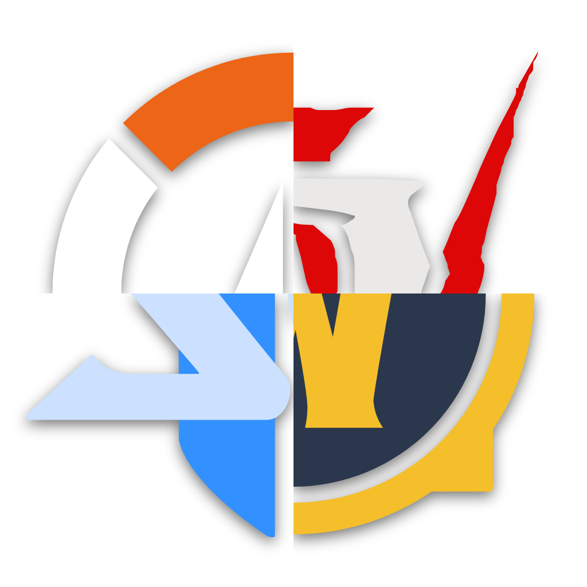
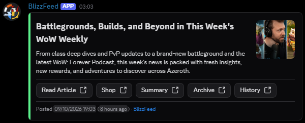
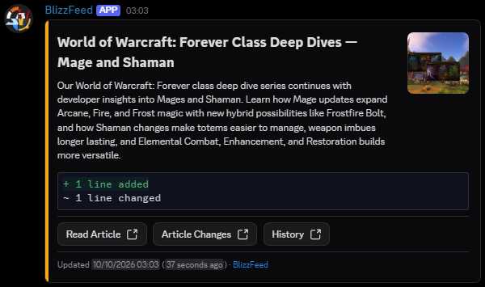
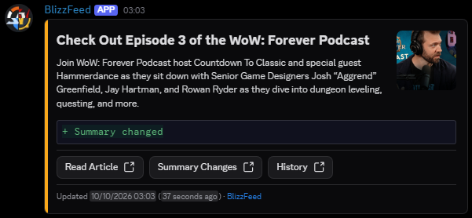
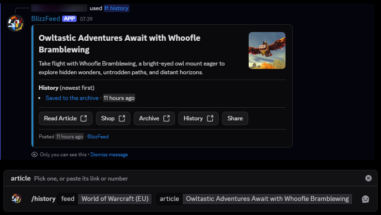
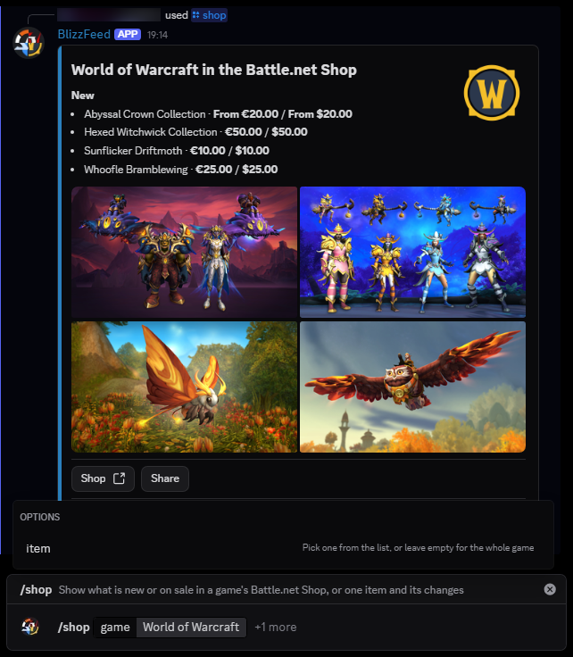

  

# BlizzFeed

BlizzFeed posts Blizzard news to Discord within minutes of it going live, one channel per game. It also notices when Blizzard quietly edits an article afterwards, and shows you exactly what changed.

It's an unofficial, fan-run project. This repository holds the code that reads the news and writes the posts.

The Discord server isn't open yet, but it's coming soon™. When it is, you'll pick the games you follow and can follow their channels into your own server.

## What it does

### New articles
BlizzFeed checks Blizzard's news pages every minute. When a new article shows up, it posts the title, summary, picture and a link to read it.

**Read Article** opens it on Blizzard's site, **Summary** shows what the feed said, **Archive** is the saved full text, **History** lists every saved version, and **Shop** appears when the article links to the Battle.net Shop.

### Quiet edits
Blizzard often changes articles after they're published. Hotfix lists grow, patch notes get corrected, a title or picture is swapped, and it usually goes unnoticed.

BlizzFeed keeps a full copy of every article's text. When something changes, it posts an orange update saying what changed, with a link to a side-by-side comparison of the lines that were added, changed or removed.

A change to the title, summary or picture is posted the same way:

### The Battle.net Shop
BlizzFeed also watches the Battle.net Shop for each game, in both the EU and US stores. It posts when an item is new, comes back, goes on or off sale, changes price, gets a badge, or is removed. Shop banners and edited item details are tracked too. Shop posts are green for new or back, orange for price, sale or badge changes, red for removed, and blue for banners and details.

### Look things up
The BlizzFeed bot also answers two commands in the Discord server, with a reply only you can see:

- `/history` shows an article's summary and its latest changes, each linked to exactly what changed.
- `/shop` shows what is new or on sale in a game's Battle.net Shop, or the price and changes of one item.

You can also have a feed's posts sent to you as direct messages with `/subscribe`.

## What's covered

| Game | Feed |
| --- | --- |
| World of Warcraft | EU and US (they word some titles and dates differently) |
| Diablo | II: Resurrected, III, IV, V and Immortal, each on its own, plus one "all Diablo" feed |
| Overwatch | one feed |
| Hearthstone | one feed |
| Heroes of the Storm | one feed |
| StarCraft | STARCRAFT, StarCraft II and StarCraft Remastered |
| Warcraft | Warcraft 3: Reforged and Warcraft Rumble |
| Blizzard | company news, BlizzCon and similar |

Every feed has three channels, so you can follow only what you want:

| Channel | You get |
| --- | --- |
| All | every new and updated post |
| New | new articles only |
| Updates | updated articles and edited article text, with what changed |

Don't follow both All and another channel for the same feed, or you'll get duplicates.

## Where the history lives

BlizzFeed saves everything it sees in this repository, on separate branches that anyone can read:

| Branch | What's on it |
| --- | --- |
| `main` | The code, the list of feeds ([sources.yaml](sources.yaml)) and the logos |
| `data` | The latest title, summary and picture of every article, one commit per new or changed article |
| `archive` | The full text of every article as a Markdown file, one commit per edit, so GitHub's diff view shows what Blizzard changed |
| `shop` | What the Battle.net Shop lists, with a card per item and a log of every change |

Open a file's history on the `archive` branch to see an article's edits over time. That's what the **History** button links to.

## How it runs

A scheduled job checks each feed every minute and compares it with what it saved last time. A second job reads the full article pages and saves the text, and re-checks recent articles every hour in case an edit didn't change the date. The first time BlizzFeed sees a feed it saves the existing articles without posting, so old articles don't flood the channels.

The scheduled jobs in `.github/workflows/` are started by the project itself, and the Discord bot that delivers the posts is private. Forking this repository won't give you a running copy.

## Looking around the code

| Path | What's there |
| --- | --- |
| [sources.yaml](sources.yaml) | The feeds to watch and how to read each one |
| [main.py](main.py) | Reads the news feeds and the Battle.net Shop |
| [archive.py](archive.py) | Saves full article text |
| [modules/](modules) | The pieces: fetching pages, finding changes, building Discord messages |
| [tests/](tests) | Automated tests. Run `pip install -r requirements-dev.txt`, then `pytest` |
| [logos/](logos) | The BlizzFeed logo in the sizes Discord and GitHub use, and each game's icon |

## Logos and trademarks
BlizzFeed is an unofficial fan project. It isn't affiliated with, endorsed by or sponsored by Blizzard Entertainment, Inc.

All game and company names, logos and icons are trademarks or registered trademarks of Blizzard Entertainment, Inc., and belong to their owners. That includes the game logos in `logos/games/`, which are Blizzard's own game icons, and the BlizzFeed logo in `logos/`, which is a combination of parts of the World of Warcraft, Diablo IV, Overwatch 2 and StarCraft II icons. They're used here only to identify the news they belong to, and no ownership is claimed.

## Credits
The idea and overall design (a scheduled Actions job, separate `source` and `data` branches, commit links in Discord messages) come from [Wumpus-Central/blog-tracker](https://github.com/Wumpus-Central/blog-tracker).
